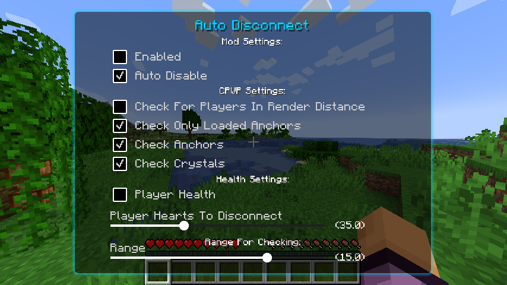
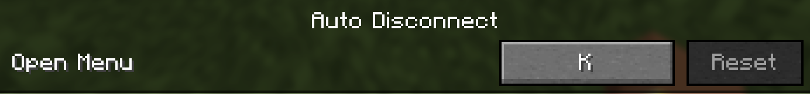
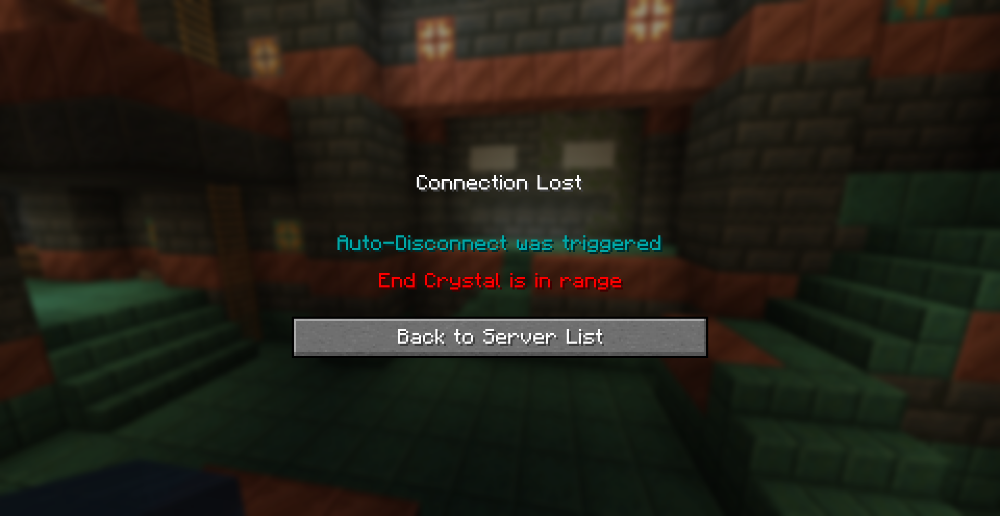

# Auto Disconnect Mod By I-No-oNe
-----------------
```yml
How to use?
# Install the latest version and install ImproperUI Library.
# Press the keybind K on your keyboard to open the GUI.
# Set the conditions for the auto disconnect.
# Turn on/off the settings as you want.
```
--------------------
## Showcase:
### GUI

----------
### Setting The Keybind

--------------------
### In-game Example:

-----------------

**BE AWARE THAT YOU MUST TO DOWNLOAD THE [**IMPROPER-UI**](https://github.com/ItziSpyder/ImproperUI/releases) LIBRARY IN ORDER TO THE MOD TO WORK!**

------------------
**tysm for using this mod** 🙏